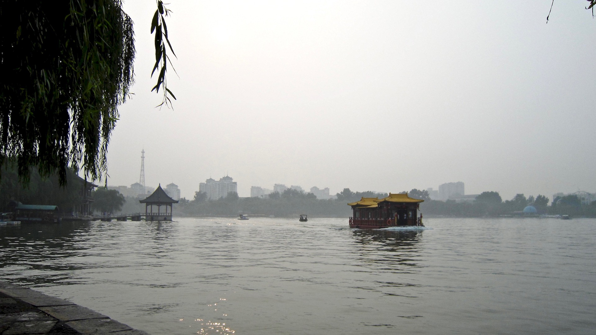

落日垂柳岸，雨后大明湖
<!--more-->
游人采莲色，画舫追湖风

荡漾六七倾，亭阁十几重

诗社今犹在，质朴是民风

济南名士多，历下有半城

---

*注1：大明湖曾有王士祯“秋柳诗社”，现在为纪念馆*

*注2：杜甫游大明湖，有《陪李北海宴历下亭》
“海右此亭古，济南名士多”*

*注3：大明湖位于历下区，湖内有“历下亭”，有名景“历下秋风”*

*注4：大明湖有刘凤诰楹联
“四面荷花三面柳，一城山色半城湖”*
