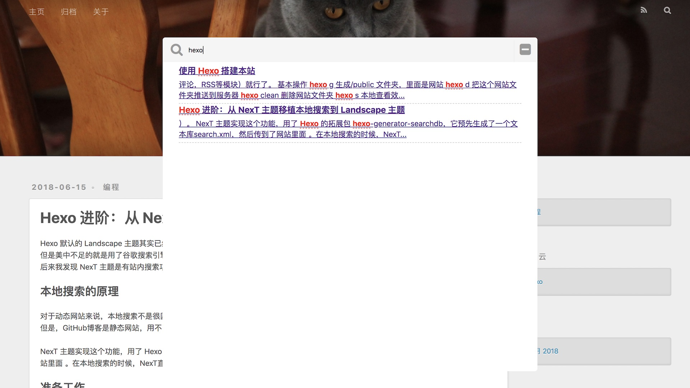

Hexo 默认的 Landscape 主题其实已经很好了，可以说简明美观，网页上的元素也不难添加。
但是美中不足的就是用了谷歌搜索引擎，谷歌在国内打不开就不说了，而且用外部搜索引擎本来也不如站内搜索便捷实用。
后来我发现 NexT 主题是有站内搜索功能的，就试着把这个功能移植了进来。

## 本地搜索的原理
对于动态网站来说，可以通过 php 实现（具体见[Github Pages(二)：个人网站的功能插件](https://hans2936.github.io/2017/10/22/PageLog/)）。
但是，GitHub博客是静态网站，用不了 php，导致我在老网站只能把google搜索结果页内置到了网站里面 （Landscape也用了谷歌）。

NexT 主题实现这个功能，用了 Hexo 的拓展包 `hexo-generator-searchdb`，它预先生成了一个文本库`search.xml`，然后传到了网站里面 。在本地搜索的时候，NexT直接用javascript调用了这个文件，从而实现了静态网站的本地搜索。

<!--more-->
## 准备工作
首先把产生文本库的包安装好，执行 `npm install hexo-generator-searchdb --save`。
然后在主配置文件 `_config.yml`里面加上
```
search:
  path: search.xml
  field: post
  format: html
  limit: 10000
```
并且在主题配置文件加上
```
local_search:
  enable: true
  trigger: auto
  top_n_per_article: 1
```
其中`trigger`表示搜索结果会不会打字时自动显示，`top_n_per_article` 表示每篇文章最多显示几条结果（-1为不限数字）。
这些只是准备工作，在把代码放到Landscape 之前，这些设置不会起任何作用。

## NexT 主题的本地搜索代码
NexT 主题的 local-search 主要是下面几个模块组成的：
- 核心javascript脚本：[localsearch.swig](https://github.com/iissnan/hexo-theme-next/blob/master/layout/_third-party/search/localsearch.swig)
- css配置文件：[localsearch.styl](https://github.com/iissnan/hexo-theme-next/blob/master/source/css/_common/components/third-party/localsearch.styl)
- 搜索框：[另一个localsearch.swig](https://github.com/iissnan/hexo-theme-next/blob/master/layout/_partials/search/localsearch.swig)
- 在header中添加链接：[header.swig](https://github.com/iissnan/hexo-theme-next/blob/master/layout/_partials/header.swig)

Landscape主题的后缀有所不同（不是.swig， 而是.ejs），这几个文件copy过来之后需要稍微改一下语法，几个图标也需要重新定义，细节如下。

## 移植步骤
### 定义"搜索"，"关闭"，"无结果"等图标
NexT 大量使用了 `<i class = "fa abc"> </i>` 这样的方式来引用 FontAwesome 图标，但是 Landscape 却不支持这么用。
所以一开始不得不定义一些图标，在主题文件夹 `themes/landscape/` 的 `/source/css/` 下面找个地方 （比如说`_partial/header.styl`），定义：
```
#icon-close:before {
  font-family: FontAwesome;
  content: "\f146";
  font-size: x-large
}
```
这样就定义了一个关闭搜索框的图标。移植的时候重新定义图标为`<span id="icon-close"></span>` 就可以了。
新定义的图标主要是搜索 `\f002`，关闭`\f146`，和无结果 `\f119`。

### 放入调出搜索框的链接
首先进入主题文件夹的`/layout/_partial/header.ejs` ，那里默认有一个搜索链接（`id="nav-search-btn" class="nav-icon"`）。
把这个链接扩展为：
```
<% if(!theme.local_search.enable) { %><a id="nav-search-btn" class="nav-icon" title="<%= __('search') %>"></a><% } %>
<% if(theme.local_search.enable) { %><a href="javascript:;" class="popup-trigger nav-icon" id="nav-search-btn"></a><% } %>
```
这也就意味着用主题配置中的 `local_search.enable` 来控制搜索功能了，打开本地搜索的情况下，搜索链接会启动`class="popup-trigger"`，也就打开了本地搜索引擎。

### 放入搜索框
还是着刚才的文件`header.ejs`，可以在最后一行`</header>`前面加上
```
<% if(theme.local_search.enable) { %><div class="local-search-inner"><%- partial('search') %></div><% } %>
```
其中 `<%- partial('search') %>` 指向了 `search.ejs`，这个文件也就是 NexT 的搜索框[另一个localsearch.swig](https://github.com/iissnan/hexo-theme-next/blob/master/layout/_partials/search/localsearch.swig)了。
把它拷贝成`search.ejs` 跟 `header.ejs` 放在一起，但是图标要全部换成适配Landscape的定义。另外直接明码写上`placeholder=" 本地搜索..."` 就可以了。

### 放入核心 javascript
把[localsearch.swig](https://github.com/iissnan/hexo-theme-next/blob/master/layout/_third-party/search/localsearch.swig)放入`/layout/_partial/`, 并且命名为`localsearch.ejs`。
然后在`/layout/layout.ejs`的最后，`</body>` 的上一行引用这个文件 `<%- partial('_partial/localsearch') %>`。
这个目的是在每一个网页的最下方加入这一段 javascript。

然后就要改这个文件了， 要改的有三项：
- 图标
跟刚才一样，凡是带`class="fa abc"` 的图标都要重新定义成适配Landscape的。
- 语法
  改成 `localsearch.ejs` 之后，这个脚本里面的两类语法要改。 一是if..else..要这样用：
  ```
  <% if (theme.local_search.enable){ %><% } %>
  ```
  二是config要这样调用（注意有个等号）：
  ```
  var search_path = "<%= config.search.path %>" ;
  ```
  大概一共三四处要改，主要是config能读到就可以了。
- 搜索框的位置
  这个脚本里面有一处容易坑的地方，就是这一行
  ```
  $('.popup').detach().appendTo('.header-inner');
  ```
  注意这个`.header-inner`是搜索框的位置，是要根据情况改的。比如我刚才在`header.ejs`定义的是
  ```
  <div class="local-search-inner"><%- partial('search') %></div>
  ```
  那就要把`.header-inner` 改为 `.local-search-inner` 了。

### 放入渲染文件，取消阴影背景
渲染文件也是必须的，可以把 [localsearch.styl](https://github.com/iissnan/hexo-theme-next/blob/master/source/css/_common/components/third-party/localsearch.styl) 放入 `/source/css/_partial/`
然后在主渲染文件`/source/css/style.styl`中，注意加上 `@import "_partial/localsearch"` 就可以了。 

不知道什么原因，这个搜索引擎的阴影背景`.local-search-pop-overlay` 总是会出现在最上方，导致搜索框出来之后根本点不到。我直接给它设置 `z-index: auto` ，跳过了这个问题。

这个文件是大部分元素的渲染文件，可以用来调整图标位置，placeholder文字的大小等等，这都是细节了。

### 把原先的搜索功能关掉
原先的搜索能在 `source/js/script.js` 里面，把这一段code移到 `localsearch.ejs` 里面，然后用一个
```
<% if (!theme.local_search.enable){ %><% } %>
```
来控制就可以了。

## 总结
最终搜索的效果截图在这里：

其实直接用 NexT 就好了，不过自己编辑主题可以趁机学习一下。毕竟还是成功了。
有一点很重要的是，自己编辑主题是免不了要debug的，要善用谷歌浏览器的检查功能（以及最简单的输出 `console.log()`，或者其他工具的同类功能）。
