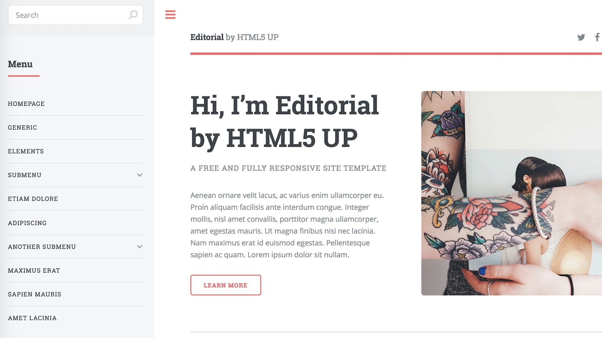

一直想做个博客网站，去网上查了一下，最先查出来的是云服务器+WordPress，不过又要买服务器，又要买域名，还得备案。
后来发现每个Github账户都可以开一个自己的静态网站（域名为 username.github.io），非常简单。
静态网站的定义参见[维基百科-网页设计](https://zh.wikipedia.org/wiki/网页设计)，虽然方便，但是也有一些功能上的限制，最显著的特点就是不能运行php和asp，不能自动读写站内的文件。
不过静态网页依然可以实现个人博客需要的所有功能，而我也只是学习一下做网页、博客什么的，这个方案已经是最好的了。

这篇博客介绍搭建一个基于html的网站框架的过程。

## 拥有并了解Github 账户
### 第一步 注册
没啥好说的，进入[https://github.com](https://github.com)，然后注册一个账户就可以了。

<!--more-->

### 第二步 确保可以自由地创建/修改/下载/上传一个库（repository）
网页是由很多html，css，js等文件组成的，对github pages来说，一个repository就是存放这些文件的文件夹，所以确保可以随心所欲的管理一个库是最基本的。

这里是第一个官方教程：[GitHub:Hello world](https://guides.github.com/activities/hello-world/)。可以通过按钮来理解一个库的构造和维护，不过这只能让你创建修改一个Readme文件。
这里你会意识到每个库是可以创建分支(branch)的，实际操作中，如果对版本要求没那么严格（做个网页而已），你可以忽略branch的存在，只用master一个默认branch即可。

这个时候你已经可以用网页看到这么一个库了，到这一步你的库可能只有一个Readme：

Github的关键就是可以用Git来控制（[维基百科-Git](https://zh.wikipedia.org/wiki/Git)），这是一个版本工具（我的理解是一个每次上传都备份一个版本，并且可以协调多人同时修改的公用网盘）。当在确定自己的终端可以使用 `git --version` 命令（Mac+Xcode自带），并且安装了SSH-Key 之后，你就可以使用如下的基本命令来控制你的库了：

```
git clone 你的SSH地址 （下载你的reposity，这个地址可以用网页浏览的Clone-or-Download-use SSH按钮看到，比如说git@github.com:uername/reposity.git）
git pull （联系服务器，更新本地文件夹）
git add --all （写入本地的所有新文件）
git commit -am "随便说点啥" （在本地进行一次有记录地更新，包括本地所有文件的修改）
git push origin master （把本地的更新推送到服务器）
```

SSH-Key决定了你的电脑有没有权限进行这些操作，这里有另一个官方教程：[GitHub:SSH](https://help.github.com/articles/connecting-to-github-with-ssh/)，这个是必须一步步跟下来的，Mac的重要命令包括：

```
ls -al ~/.ssh (查一下是不是已经有key了)
ssh-keygen -t rsa -b 4096 -C "your_email@example.com" （产生一个key，不单独设密码的话一路回车就行）
pbcopy < ~/.ssh/id_rsa.pub （把你的key复制到粘贴板，不这么复制可能太长了复制不下来）
```
Linux和Windows进入刚才的教程看就行，如下图，在点击“右上角头像”+“Settings”+“SSH and GPG Keys” 这里添加了你刚刚复制的public Key之后，你就有权限进行上述的Git操作了。

## 搭建Github Page网站
### 第一步 创建一个Github Pages repository
GitHub Pages repository跟普通的repository是一样的，唯一的区别就是他的名字必须叫做username.gihub.io。这个官方教程 [GitHub Pages](https://pages.github.com) 写的十分好懂，按这个做完之后你就有了一个你的网址 username.github.io，里面有一句 Hello World！

### 第二步 最基础的网站框架
现在离一个好网站只差一步了，就是把某个好网站的所有文件拷贝到你的文件夹里面。
GitHub官方建议你使用博客生成工具 [Jekyll](https://help.github.com/articles/using-jekyll-as-a-static-site-generator-with-github-pages/) 。GitHub在库的设置里面还提供Jekyll主题选择。而我的博客使用了[Hexo](https://hexo.io/zh-cn/)生成工具，具体见我的博客[Github Pages(三)：使用Hexo博客生成工具](https://hans2936.github.io/2018/06/06/HexoLog/)。
强烈推荐使用网站工具，这样可以直接用markdown格式编辑文章，而且使用简单的命令实现预览，生成和发布，从而节省大量的时间。

我一开始并不了解博客工具，所以去了一个模版网站 [HTML5 UP](https://html5up.net)，然后下载了其中一个模版，直接在本地打开 index.html，就看到了网站预览，如图：



然后我再手动`git add` 所有的文件到我的网站中。当你`git push`之后，你的域名就会变成这样一个网站了。这也就是一个最基础的网站了。
不用博客工具的好处是有利于学习网页知识，当博客不多的时候，对习惯使用bash+vim的人来说，这样编辑网站是可以接受的。坏处是写一个博客就多一个html，如果有比如超过50篇博客，每篇博客的公共部分就很麻烦了。

### 第三步 开始发挥吧
不管是使用博客工具，还是直接手动添加html，都离不开对 html/css/JavaScript的基本理解。比如上述简单的网站模版，很多按钮，搜索框等都是空的，需要简单的填充。而即使用了博客工具，想要添加“关于”，或者侧边栏等各种元素，也是需要运用网页语言的。
下面就是自由发挥了，继续进入[Github Pages(三)：使用Hexo博客生成工具](https://hans2936.github.io/2018/06/06/HexoLog/)使用博客生成工具，并且到[Github Pages(二):个人网站的功能插件](https://hans2936.github.io/2017/10/22/PageLog/)寻找想要使用的插件吧。
